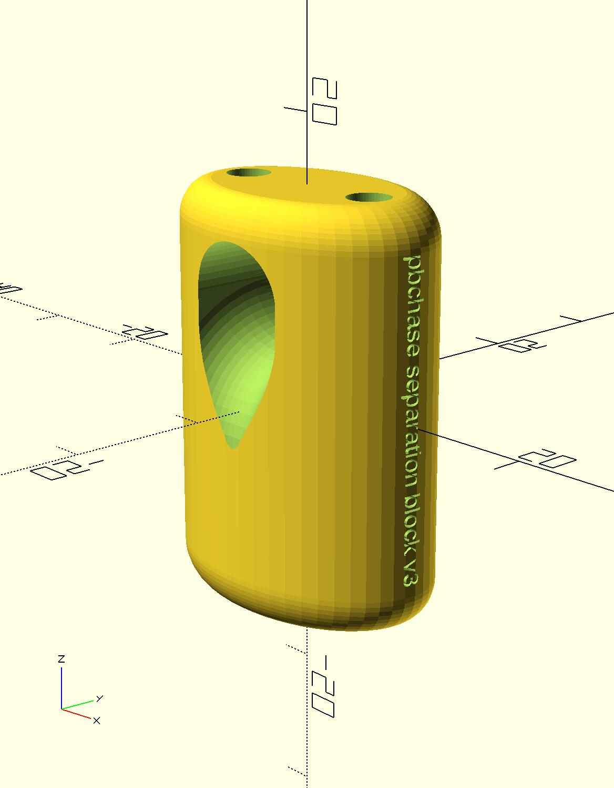
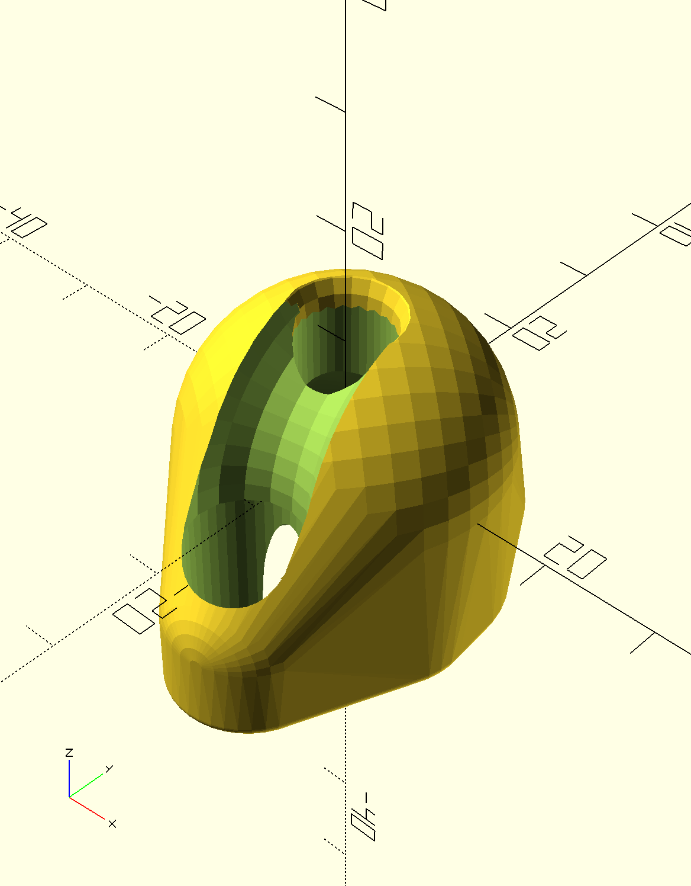
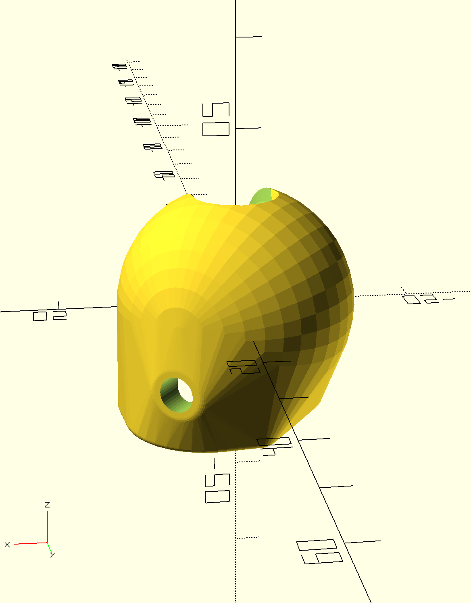

# 3D models of components for kite control bars

This repository is a collection of 3D models for components that could be used in the construction of kite control bars. The models were created with OpenSCAD, a programming language and development environment for 3D modelling. Some of these modules are complete components that have been used in actual gear. Some are speculative designs. Other are primitives used as part of a complete component.

## How to view and manipulate these models

These OpenSCAD models can be opened, viewed, and revised using free software found at [www.openscad.org](http://www.openscad.org/). The software is available for Mac OS X, Windows, and Linux.

For the most basic use, download and install OpenSCAD. Open a model and preview it. Use the viewer controls to examine the model from all sides.

To make changes you need only basic programming skills. The editor window of OpenSCAD will show the code that generates the model. Revise the values of variables defined in the file and preview the revised model to understand how each variable affects the model. Note that all dimensions are in millimeters.

## How to print these models

To print a model, use OpenSCAD to generate a vector file in STL format. Most 3D printers can use an STL file as input.

Default 3D printer settings often use a minimal number of shells and a sparse infill that is too weak to handle the loads required  for these components. To address this, use at least 3 shells and a high infill. 80% infill is not unreasonable.

Most of these designs do not need supports. In some cases overhangs have been specifically tailored to meet the Makerbot's maximum overhang recommendation of no more than 68 degrees off vertical.

## Current models

[separation\_block_v3](separation_block_v3.scad) - This component transfers load from the main flying lines by providing a pair of parallel bore holes. Each flying line passes through a bore hole. The flying line is trapped on the lower side of the block via a larks head of relatively fat line. The pair of bore holes surround a larger, toroidal central bore hole. The curved central bore provides a low friction path for the trim line. An 80-facet-count STL files has been generated with a [8mm](printable/separation_block_v3_8mm_trimline_bore_e90f9fc.stl) trim line bore. Weaker versions of this model have been tested with a 4mm Amsteel trimline with a brummel-spliced loop on the lower end. While the trim line is only 4mm in this component, the 8mm diameter of the spliced loop must pass through it for assembly.

[cleat_bead](cleat_bead.scad) - This component is meant to mate on to the pilot-end of [Clamcleat® CL826-11](https://www.clamcleat.com/aero-cleat-with-cl211-mk2.html). It fits tightly onto the end of the cleat with a positive rotational lock. The spherical shape conforms to the circular hole in the kite-side of the bar and allows for easy bar spinning.  The rotational lock allows for a flag-line guide path to be routed away from the jaws of the cleat to reduce the risk of cleating the flag line. STL files have been generated for [5mm](printable/cleat_bead_cb0d3b8.stl) trim lines.

The small hole in the side accommodates a 18-8 Stainless Steel Cone-Point Set Screw mwith 10-32 threads, 1/2 inch long. I used [item 92785A337](https://www.mcmaster.com/92785A337/) at McMaster Carr. It uses a 3/32" hex drive. Use the set screw to tap the hole by first heating it to a low heat with a torch, then screwing it in. The set screw should be screwed into the rope in the serpentine to lock the cleat bead to the cleat. This keeps the bead in place when the pilot pulls on it. 

## Deprecated models

Several [deprecated designs](deprecated.md) and [primitives](primitives.md) used in many of these designs are also available in this repo.

## Contributing

If you would like to contribute revisions to these models or add new models feel free to fork this repo, make changes and submit a pull request. You are also welcome to open an issue and attach a file or send me files at philipbchase@gmail.com. All contributions should include a Creative Commons Public Domain license.

