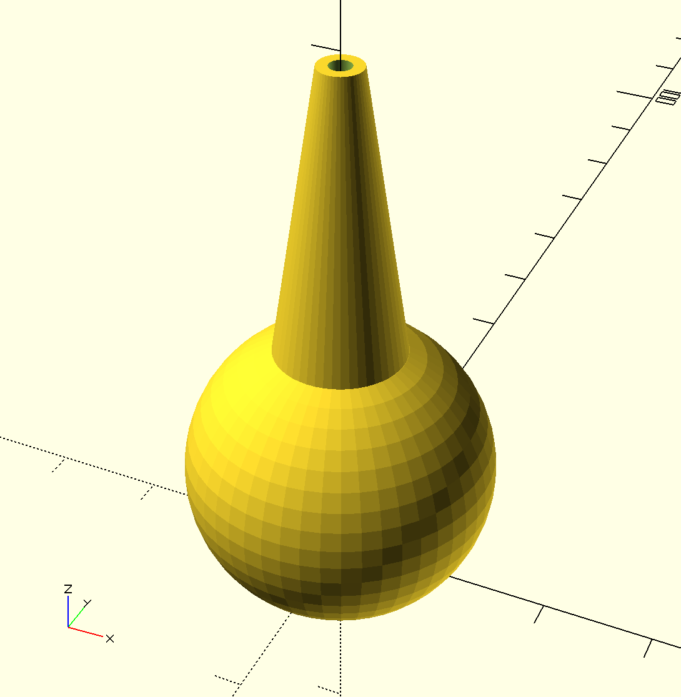
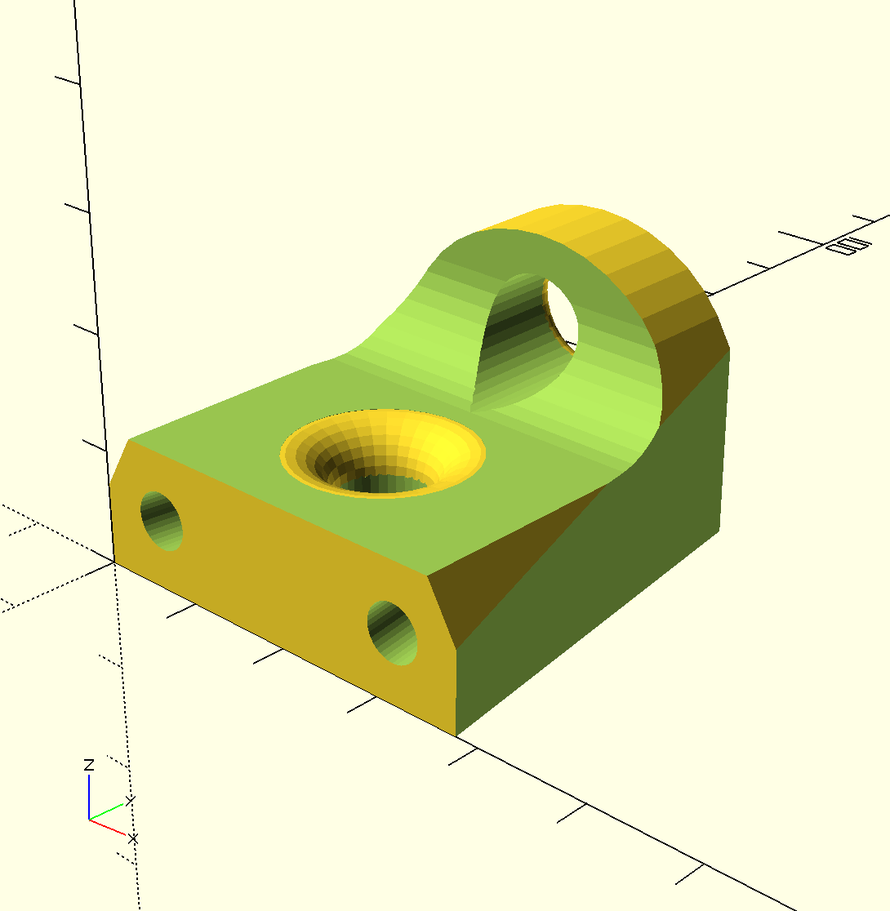

# 3D models of components for kite control bars

This repository is a collection of 3D models for components that could be used in the construction of kite control bars. The models were created with OpenSCAD, a programming language and development environment for 3D modelling. Some of these modules are complete components that have been used in actual gear. Some are speculative designs. Other are primivites used as part of a complete component.

## How to view and manipulate these models

These OpenSCAD models can be opened, viewed, and revised using free software found at [www.openscad.org](http://www.openscad.org/). The software is available for Mac OS X, Windows, and Linux.

For the most basic use, download and install OpenSCAD. Open a model and preview it. Use the viewer controls to examine the model from all sides.

To make changes you need only basic programming skills. The editor window of OpenSCAD will show the code that generates the model. Revise the values of variables defined in the file and preview the revised model to understand how each variable affects the model. Note that all dimensions are in millimeters.

## How to print these models

To print a model, use OpenSCAD to generate a vector file in STL format. Most 3D printers can use an STL file as input.

Default 3D printer settings often use a minimal number of shells and a sparse infill that is too weak to handle the loads required  for these components. To address this, use at least 3 shells and a high infill. 80% infill is not unreasonable.

Most of these designs do not need supports. In some cases overhangs have been specifically tailored to meet the Makerbot's maximum overhange recommendation of no more than 68 degrees off vertical.

## About the models

## Tested models

[wichard\_snaphook\_handle\_golf\_tee\_style](wichard_snaphook_handle_golf_tee_style.scad) - a cone-and-flange handle to open the gate of a Wichard Snap shackle.

[wichard\_snaphook\_handle](wichard_snaphook_handle.scad) - a cone-and-ball handle to open the gate of a Wichard Snap shackle. The wall thickness is thin at the base of the cone and the transition is harsh.

### Untested models

[stopper\_ball](stopper_ball.scad) - The ball used in a moveable stopper on a kite bar trim line. This component has never been tested.

[stopper\_block](stopper_block.scad) - The block in a moveable stopper. This component has never been tested. Its edges are far harsher than what is possible when machining such a block from Delrin.

[wichard\_snaphook\_release\_cone](wichard_snaphook_release_cone.scad) - a cone to open the gate of a Wichard Snap shackle.  This component has never been tested.

### Primitives

[elliptical\_cone](elliptical_cone.scad) - a primitive the generates a vertically orients cone with a profile of 1/4 of an ellipse.

[elliptical\_torus](elliptical_torus.scad) - a primitive the generates a torus with a eliptical cross section. It includes a primitive for an ellipse as well.

[fillet\_around\_cylinder\_base](fillet_around_cylinder_base.scad) - a primitive that generates a cylinder surrounded by a 1/4 circle fillet.

## Contributing

If you would like to contribute revisions to these models or add new models feel free to fork this repo, make changes and submit a pull request. You are also welcome to open an issue and attach a file or send me files at philipbchase@gmail.com. All contributions should include a Creative Commons Public Domain license.

