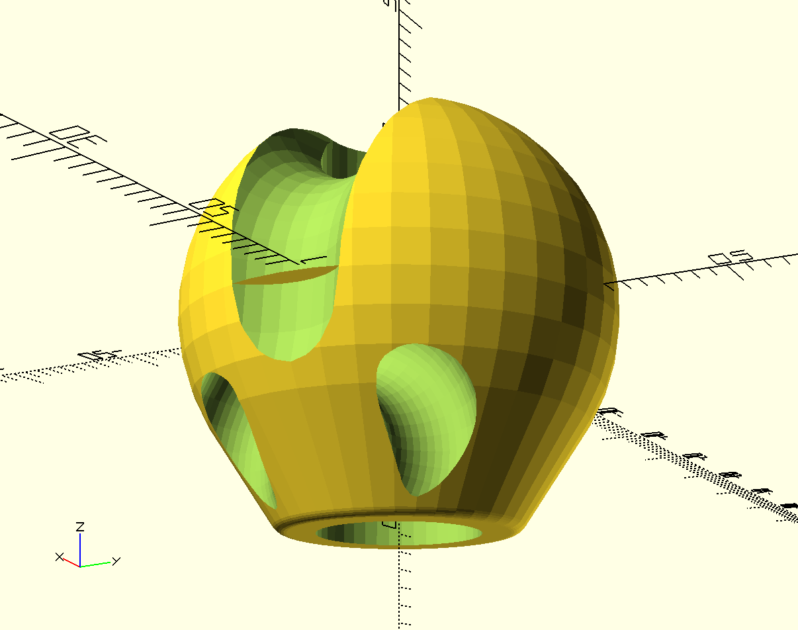
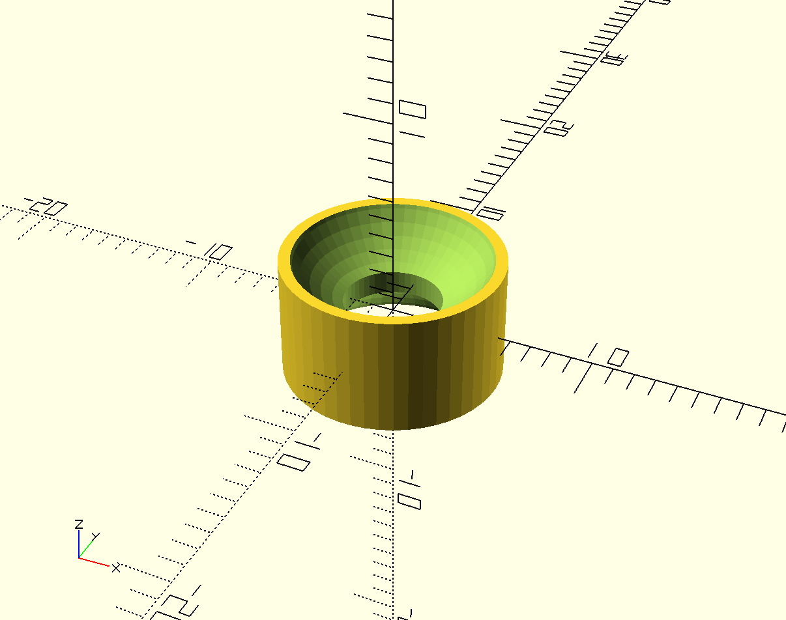
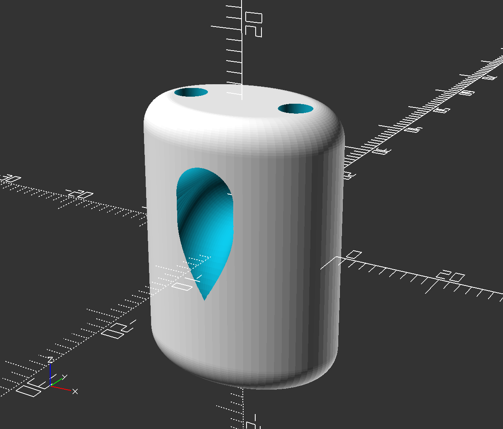

# 3D models of components for kite control bars

This repository is a collection of 3D models for components that could be used in the construction of kite control bars. The models were created with OpenSCAD, a programming language and development environment for 3D modelling. Some of these modules are complete components that have been used in actual gear. Some are speculative designs. Other are primitives used as part of a complete component.

## How to view and manipulate these models

These OpenSCAD models can be opened, viewed, and revised using free software found at [www.openscad.org](http://www.openscad.org/). The software is available for Mac OS X, Windows, and Linux.

For the most basic use, download and install OpenSCAD. Open a model and preview it. Use the viewer controls to examine the model from all sides.

To make changes you need only basic programming skills. The editor window of OpenSCAD will show the code that generates the model. Revise the values of variables defined in the file and preview the revised model to understand how each variable affects the model. Note that all dimensions are in millimeters.

## How to print these models

To print a model, use OpenSCAD to generate a vector file in STL format. Most 3D printers can use an STL file as input.

Default 3D printer settings often use a minimal number of shells and a sparse infill that is too weak to handle the loads required  for these components. To address this, use at least 3 shells and a high infill. 80% infill is not unreasonable.

Most of these designs do not need supports. In some cases overhangs have been specifically tailored to meet the Makerbot's maximum overhang recommendation of no more than 68 degrees off vertical.

## About the models

## Tested models

[wichard\_snaphook\_handle\_golf\_tee\_style](wichard_snaphook_handle_golf_tee_style.scad) - a cone-and-flange handle to open the gate of a Wichard Snap shackle. An [STL file](printable/wichard_snaphook_handle_golf_tee_style_8677c59.stl) is available. While this model reliably opens the gate and does so with little force it has opened unexpectedly in field testing. This happened three times in about 5 hours of testing. The problem occurs when the harness and the handles are forced down onto the pilot's thigh. Apprently, the base of the handle stands on the thigh as the snap hook is forced down against the thigh. This pulls the cord in the gate, pulls the opposite handle into the gate and triggers the release. See  _Untested Models_ below for the next iteration of the design.

[stopper\_ball](stopper_ball.scad) - The ball used in a moveable stopper on a kite bar trim line. STL files have been generated for
[4mm\_amsteel\_blue\_trimline](printable/stopper_ball_4mm_amsteel_36bc488.stl) and
[5mm\_amsteel\_blue\_trimline](printable/stopper_ball_modern_5mm_amsteel_36bc488.stl). The previous iteration of this ball was field tested and worked very well. This iteration removes a twist in the bungie path. To print it reliably, using a support structure that surrounds the base.

[stopper\_block\_v4](stopper_block_v4.scad) - This block is used in tandem with the stopper ball to form a moveable stopper. A slightly earlier version of this design has been field tested. This version should be easier to print than the previous version. STL files have been generated for
[4mm\_amsteel\_blue\_trimline](printable/stopper_block_v4_4mm_amsteel.stl) and
[5mm\_amsteel\_blue\_trimline](printable/stopper_block_v4_modern_5mm_amsteel.stl).

[separation\_block_v1](separation_block_v1.scad) - This component transfers load from the main flying lines by providing a pair of parallel bore holes. Each flying line passes through a bore hole. The flying line is trapped on the lower side of the block via a larks head of relatively fat line. The pair of bore holes surround a larger, central bore hole. The central bore hole allows a heavier line to be secured to the separation block. The upper end is secured via an overhand knot. The lower end of the central line entraps a low friction ring that acts as a pulley for the trim line. An [STL File](separation_block_v1_9a972b6.stl) is available.

### Untested models

**Three part wichard snaphook** -  This design is uses six components to form a fid and a handle to actuate a wichard snaphook. The components are
[wichard\_snaphook\_handle\_concave\_link](wichard_snaphook_handle_concave_link.scad),
[wichard\_snaphook\_cone\_fid](wichard_snaphook_cone_fid.scad) and
[wichard\_snaphook\_handle\_for\_cone\_fid](wichard_snaphook_handle_for_cone_fid.scad).  [STL files](printable/) are available for each.  A pair of each component is printed to out fit a single snaphook. This design is untested.

[separation\_block_v2](separation_block_v2.scad) - This component transfers load from the main flying lines by providing a pair of parallel bore holes. Each flying line passes through a bore hole. The flying line is trapped on the lower side of the block via a larks head of relatively fat line. The pair of bore holes surround a larger, toroidal central bore hole. The curved central bore provides a low friction path for the trim line. STL files have been generated for [5mm](printable/separation_block_v2_5mm_trimline_976518e.stl) and [6mm](printable/separation_block_v2_6mm_trimline_283f6bb.stl) trim lines. This design is untested.

Several [deprecated designs](deprecated.md) and [primitives](primitives.md) used in many of these designs are also available in this repo.

## Contributing

If you would like to contribute revisions to these models or add new models feel free to fork this repo, make changes and submit a pull request. You are also welcome to open an issue and attach a file or send me files at philipbchase@gmail.com. All contributions should include a Creative Commons Public Domain license.

