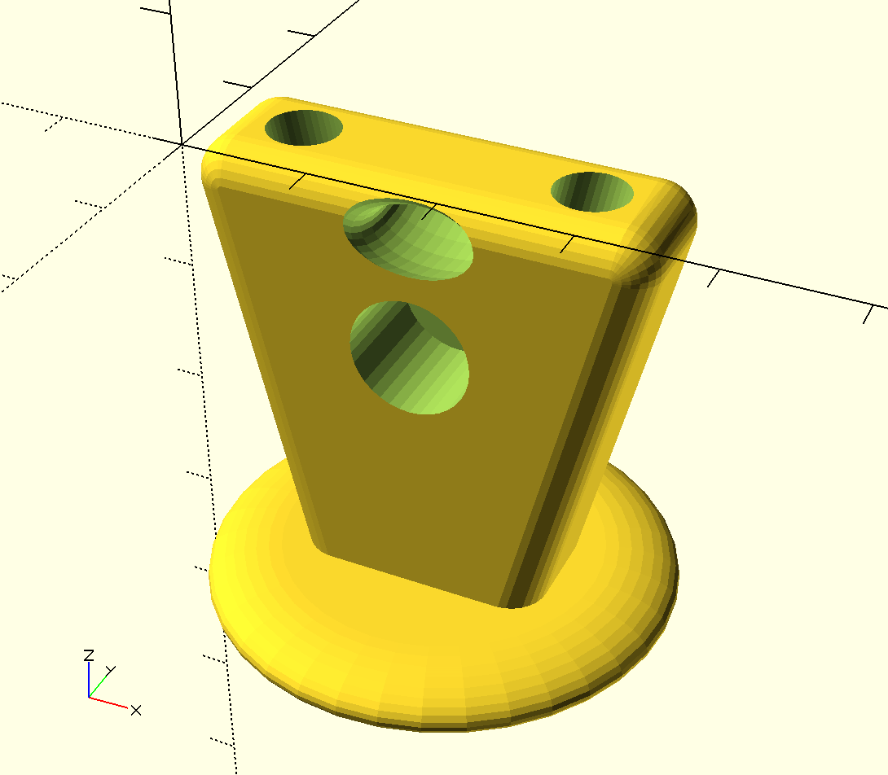

# 3D models of components for kite control bars

This repository is a collection of 3D models for components that could be used in the construction of kite control bars. The models were created with OpenSCAD, a programming language and development environment for 3D modelling. Some of these modules are complete components that have been used in actual gear. Some are speculative designs. Other are primivites used as part of a complete component.

## How to view and manipulate these models

These OpenSCAD models can be opened, viewed, and revised using free software found at [www.openscad.org](http://www.openscad.org/). The software is available for Mac OS X, Windows, and Linux.

For the most basic use, download and install OpenSCAD. Open a model and preview it. Use the viewer controls to examine the model from all sides.

To make changes you need only basic programming skills. The editor window of OpenSCAD will show the code that generates the model. Revise the values of variables defined in the file and preview the revised model to understand how each variable affects the model. Note that all dimensions are in millimeters.

## How to print these models

To print a model, use OpenSCAD to generate a vector file in STL format. Most 3D printers can use an STL file as input.

Default 3D printer settings often use a minimal number of shells and a sparse infill that is too weak to handle the loads required  for these components. To address this, use at least 3 shells and a high infill. 80% infill is not unreasonable.

Most of these designs do not need supports. In some cases overhangs have been specifically tailored to meet the Makerbot's maximum overhange recommendation of no more than 68 degrees off vertical.

## About the models

## Tested models

[wichard\_snaphook\_handle\_golf\_tee\_style](wichard_snaphook_handle_golf_tee_style.scad) - a cone-and-flange handle to open the gate of a Wichard Snap shackle.

### Untested models

[stopper\_ball](stopper_ball.scad) - The ball used in a moveable stopper on a kite bar trim line. This component has never been tested.

[stopper\_block\_v4](stopper_block_v4.scad) - This block is used in tandem with the stopper ball to form a moveable stopper. This 3D model has never been tested in the field. It is 4mm narrow than stopper\_block\_v2 and v3. It provides a wider path for the bungie and a flange on the back side for pushing the stopper away.

[separation\_block](separation_block_v1.scad) - This component transfers load from the main flying lines by providing a pair of parallel bore holes. Each flying line passes through a bore hole. The flying line is trapped on the lower side of the block via a larks head of relatively fat line. The pair of bore holes surround a larger, central bore hole. The central bore hole allows a heavier line to be secured to the separation block. The upper end is secured via an overhand knot. The lower end of the central line entraps a low friction ring that acts as a pulley for the trim line.

Several [deprecated designs](deprecated.md) and [primitives](primitives.md) used in many of these designs are also available in this repo.

## Contributing

If you would like to contribute revisions to these models or add new models feel free to fork this repo, make changes and submit a pull request. You are also welcome to open an issue and attach a file or send me files at philipbchase@gmail.com. All contributions should include a Creative Commons Public Domain license.

