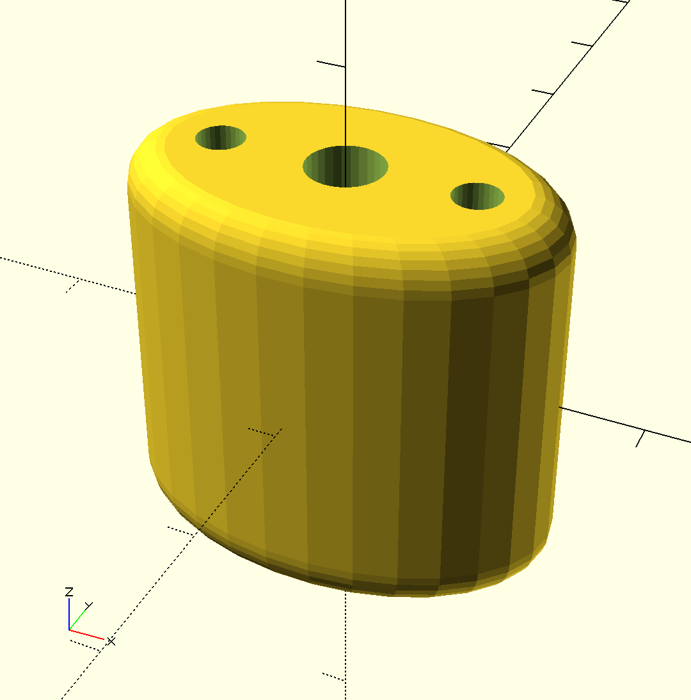
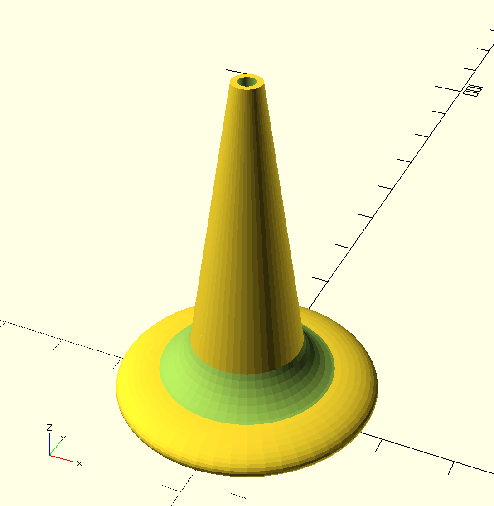

# Deprecated Designs

These designs have all been superceded by more functional shapes or have been otherwise retired.

## chickenloop_release

I've resisted the use of chickenloops for quite sometime, but every snap shackle I have tried presents issues in reliable use for newbies, or inadvertent release for experienced fliers. It's hard to beat the simplicity of a chickenloop with a push-away release. [chickenloop_release](chickenloop_release.scad), is the model for that release. The release doubles as a below-the-bar handle for the kite. As an Arc flier this is valuable feature for handling the kite while it's parked at zenith. The release is designed to accommodate a doubled trimline of 4mm Amsteel Blue through the center bore. A 0.102" stainless steel pin crosses and divides the center bore to provide a retainer for the trimline. The prototypes for this model use a 40mm stainless steel cotter pin to retain the free end of the chickenloop. The side bores retain a segment of 1/8" bungie that pushes the chickenloop and cotter pin together. A 90-facet-count [STL file](printable/chickenloop_release_d1928a2.stl) is available.

[stopper\_ball](stopper_ball.scad) - The ball used in a moveable stopper on a kite bar trim line. STL files have been generated for
[4mm\_amsteel\_blue\_trimline](printable/stopper_ball_4mm_amsteel.stl) and
[5mm\_amsteel\_blue\_trimline](printable/stopper_ball_modern_5mm_amsteel.stl). The previous iteration of this ball was field tested and worked very well. This iteration removes a twist in the bungie path. To print it reliably, use a support structure that surrounds the base.

[stopper\_block\_v4](stopper_block_v4.scad) - This block is used in tandem with the stopper ball to form a moveable stopper. A slightly earlier version of this design has been field tested. This version should be easier to print than the previous version. STL files have been generated for
[4mm\_amsteel\_blue\_trimline](printable/stopper_block_v4_4mm_amsteel.stl) and
[5mm\_amsteel\_blue\_trimline](printable/stopper_block_v4_modern_5mm_amsteel.stl).

[separation\_block_v1](separation_block_v1.scad) - This component transfers load from the main flying lines by providing a pair of parallel bore holes. Each flying line passes through a bore hole. The flying line is trapped on the lower side of the block via a larks head of relatively fat line. The pair of bore holes surround a larger, central bore hole. The central bore hole allows a heavier line to be secured to the separation block. The upper end is secured via an overhand knot. The lower end of the central line entraps a low friction ring that acts as a pulley for the trim line. An [STL File](printable/separation_block_v1_9a972b6.stl) is available.

**Three part wichard snaphook** -  This design is uses six components to form a fid and a handle to actuate a wichard snaphook. The components are
[wichard\_snaphook\_handle\_concave\_link](wichard_snaphook_handle_concave_link.scad),
[wichard\_snaphook\_cone\_fid](wichard_snaphook_cone_fid.scad) and
[wichard\_snaphook\_handle\_for\_cone\_fid](wichard_snaphook_handle_for_cone_fid.scad).  [STL files](printable/) are available for each.  A pair of each component is printed to out fit a single snaphook. This design accidentally released once in a 3 hour session. That's still too high.

[wichard\_snaphook\_handle\_golf\_tee\_style](wichard_snaphook_handle_golf_tee_style.scad) - a cone-and-flange handle to open the gate of a Wichard Snap shackle. An [STL file](printable/wichard_snaphook_handle_golf_tee_style_8677c59.stl) is available. While this model reliably opens the gate and does so with little force it has opened unexpectedly in field testing. This happened three times in about 5 hours of testing. The problem occurs when the harness and the handles are forced down onto the pilot's thigh. Apprently, the base of the handle stands on the thigh as the snap hook is forced down against the thigh. This pulls the cord in the gate, pulls the opposite handle into the gate and triggers the release. See  _Untested Models_ below for the next iteration of the design.

[wichard\_snaphook\_handle](wichard_snaphook_handle.scad) - a cone-and-ball handle to open the gate of a Wichard Snap shackle. The wall thickness is thin at the base of the cone and the transition is harsh.

[stopper\_block\_v3](stopper_block_v3.scad) - This block is used in tandem with the stopper ball to form a moveable stopper. This 3D model has never been tested in the field. It is 4mm narrow than stopper\_block\_v2 and uses octagonal horizontal bores to reduce overhang issues when printing. An [STL file](printable/stopper_block_v3_9c3c682.stl) is available.

[stopper\_block\_v2](stopper_block_v2.scad) - This block is used in tandem with the stopper ball to form a moveable stopper. This 3D model has never been tested. That said, it is based on a hand-made design, cut from Delrin, that has been tested extensively. This model is closer to the hand-made design than the original [stopper\_block](stopper_block.scad) model.

[stopper\_block](stopper_block.scad) - This block is used in tandem with the stopper ball to form a moveable stopper.  This 3D model has never been tested. That said, it is based on a hand-made design, cut from Delrin, that has been tested extensively.  The edges of this model are far harsher than what is possible when machining such a block from Delrin. The harsh edges might make it unsuitable for regular use.

[wichard\_snaphook\_release\_cone](wichard_snaphook_release_cone.scad) - a cone to open the gate of a Wichard Snap shackle.  This component has never been tested.

