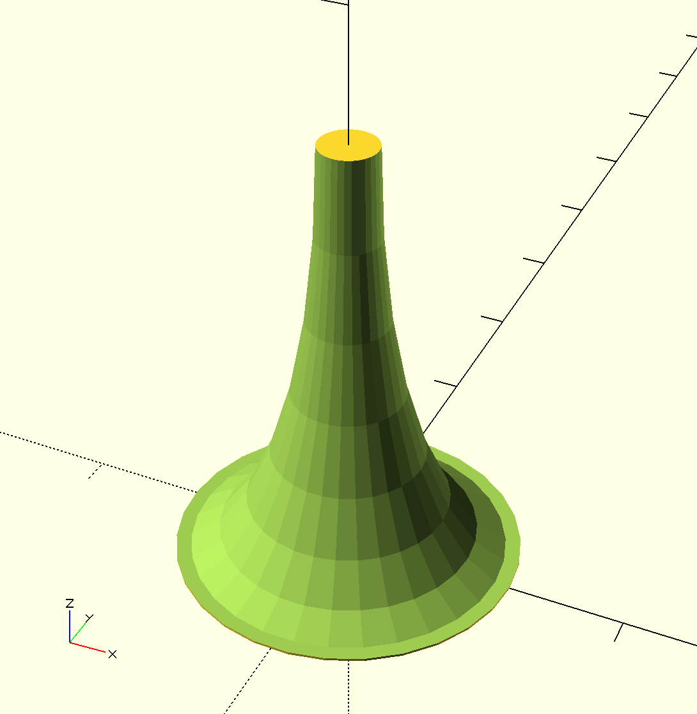
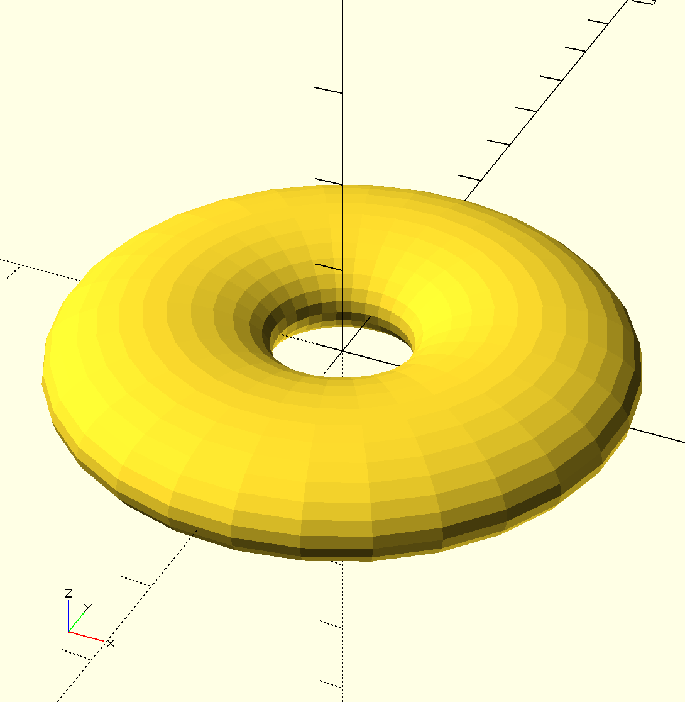

### Primitives

[elliptical\_cone](elliptical_cone.scad) - a primitive the generates a vertically orients cone with a profile of 1/4 of an ellipse.

[elliptical\_torus](elliptical_torus.scad) - a primitive the generates a torus with a eliptical cross section. It includes a primitive for an ellipse as well.

[fillet\_around\_cylinder\_base](fillet_around_cylinder_base.scad) - a primitive that generates a cylinder surrounded by a 1/4 circle fillet.

